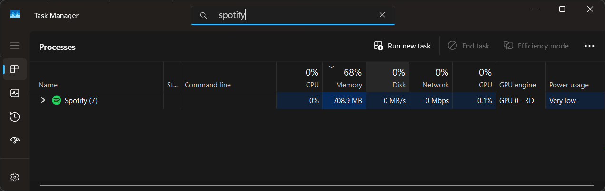
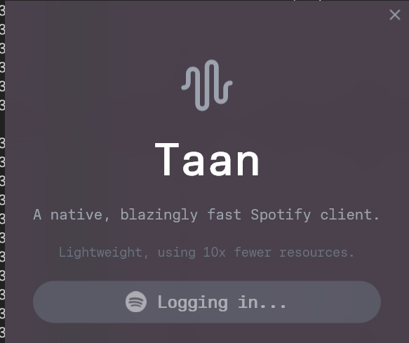

# Building Taan: A Native Spotify Client in Rust

## Why Another Spotify Client?

Picture this: You're working on your laptop, listening to music on Spotify, and suddenly everything slows down. You check Task Manager and gasp—Spotify is consuming **700MB of RAM**. For a music player. Just to stream audio and show a UI.

That's when I decided: *enough is enough*. I'm building my own.



Meet **Taan**—a native Spotify client built from the ground up in Rust, delivering the same functionality while using just **24MB of memory**. That's a **96% reduction** in memory consumption.

## The Tech Stack Journey

Building Taan was a journey through Rust's GUI ecosystem, and boy, was it an adventure. Here's how it evolved:

### Act I: The Vello Experiment

I started with **Xilem** from the Linebender community, attracted by their cutting-edge **Vello 2D renderer** that leverages GPU compute pipelines. On paper, it was perfect—hardware-accelerated rendering, modern architecture, pure Rust.

Reality check: Vello consumed **250MB of RAM on Windows 11**. Worse, there was virtually no documentation. Every feature required diving into GitHub examples or internal source code. And without hot reloading, every UI tweak meant waiting a minute or more for compilation. 

**The dealbreaker?** No live preview made designing the UI painful. Imagine adjusting button padding, waiting 60 seconds to compile, realizing it's 2 pixels too much, rinse and repeat.

### Act II: Enter Slint

Then I discovered **Slint**—a production-ready GUI framework used in embedded devices by actual customers. Created by ex-Qt engineers (and heavily inspired by QML), Slint offers:

- **Custom DSL** for declarative UI design
- **Skia renderer** (the same one powering Chrome and Flutter)
- **LSP support** with live preview
- **Compile-time UI generation** (no runtime overhead like QML)
- Memory usage: **~24MB**

Here's what Slint code looks like:

```slint
import { Colors } from "components/common/colors.slint";

export component MusicPlayer {
    if root.width < root.height: VerticalLayout {
        padding: 0px;
        spacing: 0px;

        // Album art section
        Rectangle {
            horizontal-stretch: 0;
            vertical-stretch: 1;
            AlbumArt { }
        }

        // Controls section
        PlayerControls { }
    }
    if root.height < root.width: HorizontalLayout {
        // ... horizontal layout for landscape
    }
}
```


Slint's declarative syntax makes building responsive UIs natural. The conditional layouts above automatically adapt between portrait and landscape orientations.

### Honorable Mentions

Before settling on Slint, I also considered:

- **Tauri**: Great DX, but relies on system webviews (WebView-GTK on Linux is... let's just say "unreliable"). Memory usage is better than Electron but still high.
- **Dioxus + Blitz**: I love their React-like syntax and DX. But Blitz is immature—missing CSS features, barebones events, and it uses Vello (back to the memory problem). I might contribute a Skia backend to their `anyrender` crate.

## The Spotify Integration Dance

Taan uses a **dual-client architecture** to interface with Spotify:

### 1. librespot: The Audio Powerhouse

For playback, I use **librespot**—a reverse-engineered implementation of Spotify's internal APIs. This gives us direct streaming capabilities:

```rust
use librespot_core::{Session, SessionConfig, SpotifyId, cache::Cache};
use librespot_playback::{
    audio_backend,
    config::{AudioFormat, PlayerConfig},
    player::Player,
};

pub struct SpotifyService {
    session: Session,
    pub player: Arc<Player>,
    client: Arc<AuthCodeSpotify>,
}

impl SpotifyService {
    pub fn load_track(&self, id: String) -> Result<(), Error> {
        let track_id = SpotifyId::from_uri(&id)?;
        self.player.load(track_id, false, 0);
        log::info!("Loaded track {}", id);
        Ok(())
    }
}
```

### 2. rspotify: The Metadata Maestro

For everything else—playlists, user library, track metadata—I use **rspotify**, a clean wrapper around Spotify's Web API:

```rust
pub async fn get_user_playlists(
    &self,
    limit: u32,
    offset: u32,
) -> Result<Vec<SimplifiedPlaylist>, Error> {
    loop {
        match self
            .client
            .current_user_playlists_manual(Some(limit), Some(offset))
            .await
        {
            Ok(playlists) => break Ok(playlists.items),
            Err(e) => {
                if self.requires_refresh(e).await {
                    continue; // Retry after token refresh
                }
                break Err(Error::unauthenticated(
                    "Failed to refresh client"
                ));
            }
        }
    }
}
```


## The Architecture

Taan follows a clean separation of concerns:

```
src/
├── lib.rs              # Entry point, Tokio runtime setup
├── main.rs             # Main function wrapper
├── models/             # Data structures
├── services/           # Business logic (Spotify integration)
└── viewmodels/         # UI state management

ui/
├── main.slint          # Root UI component
├── player.slint        # Music player interface
└── components/
    ├── common/         # Reusable components (buttons, sliders)
    └── player/         # Player-specific components
```

### The Async Bridge Pattern

One critical challenge: **Slint runs on the main thread, but Spotify operations are async**. The solution? A dedicated Tokio runtime on a separate thread:

```rust
fn setup(
    token: tokio_util::sync::CancellationToken,
    ui_weak: slint::Weak<MainWindow>,
) -> tokio::io::Result<std::thread::JoinHandle<()>> {
    env_logger::init();
    
    // Create dedicated async runtime
    let rt = tokio::runtime::Builder::new_multi_thread()
        .enable_all()
        .build()?;
    let rt_handle = rt.handle().clone();
    
    // Spawn runtime on separate thread
    let join = std::thread::spawn(move || {
        rt.block_on(token.cancelled());
        log::info!("Tokio Thread closed");
    });
    
    // Initialize Spotify service
    let spot = rt_handle.block_on(async { 
        services::spotify::SpotifyService::default() 
    });
    
    services::init(spot, rt_handle, ui_weak);
    Ok(join)
}
```

This pattern keeps the UI responsive while Spotify operations run asynchronously in the background.

### Event-Driven Player Updates

The player listens to librespot events and updates the UI accordingly:

```rust
fn handle_player_event(event: librespot_playback::player::PlayerEvent) {
    match event {
        PlayerEvent::Playing { track_id, position_ms, .. } => {
            log::info!("Resuming playback of {}", track_id);
            player::set_position(position_ms).unwrap();
            player::play().unwrap();
        }
        PlayerEvent::Paused { track_id, position_ms, .. } => {
            log::info!("Paused playback of {}", track_id);
            player::pause().unwrap();
            player::set_position(position_ms).unwrap();
        }
        PlayerEvent::TrackChanged { audio_item } => {
            log::info!("{:#?}", audio_item);
            if let Some(url) = audio_item.covers.first() {
                let url = url.url.clone();
                rt().spawn(async move {
                    match spotify().fetch_cover_art(url).await {
                        Ok(img) => player::set_cover_art(img).unwrap(),
                        Err(e) => log::error!("Failed to fetch: {}", e),
                    }
                });
            }
            player::set_track_details(audio_item).unwrap();
        }
        _ => { /* Handle other events */ }
    }
}
```


## Design System: The Slint Way

Taan uses a centralized design system defined in `colors.slint`:

```slint
export global Colors {
    // Primary background colors
    out property <brush> background-primary: rgba(74, 62, 76, 0.8);
    out property <brush> background-secondary: rgba(107, 114, 128, 0.5);
    
    // Text colors
    out property <brush> text-primary: white;
    out property <brush> text-secondary: #9ca3af;
    
    // Button states
    out property <brush> button-background-default: rgba(107, 114, 128, 0.5);
    out property <brush> button-background-hover: rgba(107, 114, 128, 0.6);
    out property <brush> button-background-pressed: rgba(107, 114, 128, 0.7);
}

export global Spacing {
    out property <length> xs: 4px;
    out property <length> sm: 8px;
    out property <length> md: 12px;
    out property <length> lg: 16px;
}
```

Every component imports and uses these values, ensuring visual consistency:

```slint
import { Colors, Spacing } from "components/common/colors.slint";

Rectangle {
    background: Colors.background-primary;  // ✓
    background: #4a3e4c;                    // ✗ Never hardcode!
}
```

## The Challenges (And Learning Opportunities)

### Slint's Limitations

While Slint is great, it has some rough edges:

1. **Limited language features**: The Slint DSL is restrictive. Complex logic requires Rust callbacks.
2. **Immature ecosystem**: Features like multimedia playback and transform transitions need workarounds.
3. **Documentation gaps**: Some advanced patterns require reading Slint's source code.

Compare this to **QML** which uses full JavaScript, giving more flexibility. But QML requires a runtime, while Slint compiles to native code—a worthy tradeoff.

### OAuth Authentication

Implementing Spotify's OAuth flow was interesting. I used `librespot-oauth` to handle the browser-based authentication:

```rust
pub async fn auth(&self) -> Result<(), Error> {
    let c = librespot_oauth::OAuthClientBuilder::new(
        SPOTIFY_CLIENT_ID,
        "http://127.0.0.1:8898/login",
        OAUTH_SCOPES.to_vec(),
    )
    .open_in_browser()
    .build()?
    .get_access_token_async()
    .await
    .map(|t| Credentials::with_access_token(t.access_token))?;
    
    self.connect(c).await?;
    Ok(())
}
```

The client opens a browser, user logs in, Spotify redirects to localhost:8898, and we capture the token. Simple and secure.



### Token Management & Rate Limiting

Spotify's API has rate limits and token expiration. I implemented automatic retry logic:

```rust
async fn requires_refresh(&self, e: ClientError) -> bool {
    if let ClientError::Http(e) = e {
        if let HttpError::StatusCode(res) = *e {
            if res.status() == 401 {
                // Token expired, refresh it
                self.web_auth().await.unwrap_or_else(|e| {
                    log::error!("Failed to refresh: {}", e);
                });
                return true;
            }
            if res.status() == 429 {
                // Rate limited, wait and retry
                let wait = res.headers()
                    .get("Retry-After")
                    .and_then(|v| v.to_str().ok()?.parse::<u64>().ok());
                tokio::time::sleep(Duration::from_secs(
                    wait.unwrap_or_default()
                )).await;
                return true;
            }
        }
    }
    false
}
```

This pattern wraps API calls in a loop that automatically handles auth and rate limit errors.

## Performance Metrics

Let's talk numbers:

| Metric | Official Spotify | Taan |
|--------|------------------|------|
| **Idle Memory** | ~700MB | ~24MB |
| **Playing Music** | ~750MB | ~30MB |
| **CPU Usage (idle)** | 2-3% | <1% |
| **Startup Time** | 10-15s | 1-2s |
| **Binary Size** | ~90MB | ~15MB |


The memory savings are dramatic. This is the power of native code combined with efficient libraries.

## Build System

Taan uses a simple build process:

```rust
// build.rs
fn main() {
    slint_build::compile("ui/main.slint")
        .expect("Slint build failed");
}
```

The Slint compiler runs at build time, generating Rust code from `.slint` files. This is imported via a macro:

```rust
// lib.rs
slint::include_modules!();
```

For development, I use **Bacon** for hot reloading:

```bash
bacon run        # Watch mode with auto-restart
bacon clippy-all # Lint all code
```

## Want to Contribute?

Taan is open source and **actively seeking contributors**! Here are areas where you can help:

### 🎯 Immediate Needs
- **Playlist management UI**: Create, edit, and organize playlists
- **Search functionality**: Search tracks, albums, artists
- **Queue system**: View and manipulate the play queue
- **Keyboard shortcuts**: Media key support, global hotkeys

### 🚀 Advanced Features
- **Lyrics display**: Integrate lyrics API
- **Equalizer**: Audio DSP filters
- **Podcast support**: Handle Spotify podcasts
- **Desktop integration**: System tray, notifications, Discord RPC

### 🎨 UI/UX Improvements
- **Theme system**: Custom themes and color schemes
- **Animations**: Smooth transitions and micro-interactions
- **Responsive design**: Better tablet and small screen support

### 🐛 Bug Fixes & Optimizations
- **Memory profiling**: Find and fix memory leaks
- **Caching strategies**: Improve offline capability
- **Cross-platform testing**: Test on Linux and macOS

**[Screenshot Placeholder: Taan Future Roadmap Mockup]**

## The Tech Stack Summary

Here's what powers Taan:

```toml
[dependencies]
# Spotify Integration
librespot-core = "0.7.1"          # Core Spotify client
librespot-playback = "0.7.1"      # Audio playback
rspotify = "0.15.1"               # Web API wrapper

# UI Framework
slint = { version = "1.13.1",     # GUI framework
         features = ["renderer-skia", "backend-winit"] }

# Async Runtime
tokio = { version = "1",          # Async runtime
         features = ["full"] }

# Utilities
reqwest = "0.12.23"               # HTTP client
image = "0.25.8"                  # Image processing
anyhow = "1"                      # Error handling
chrono = "0.4.42"                 # Date/time handling
```

## Lessons Learned

Building Taan taught me valuable lessons:

1. **Choose mature frameworks**: Bleeding-edge tech is exciting but documentation matters.
2. **Memory matters**: Native code + smart libraries = massive efficiency gains.
3. **Design systems early**: Centralized theming saves countless hours.
4. **Thread carefully**: Async/UI interaction requires thoughtful architecture.
5. **The 80/20 rule**: 20% of Spotify's features cover 80% of use cases.

## The Bottom Line

Taan proves that native applications still have a place in our web-dominated world. With careful technology choices and efficient implementation, you can build software that's **faster**, **lighter**, and **more responsive** than Electron-based alternatives.

Is it perfect? No. Is it production-ready? Not yet. Is it a fun learning experience that demonstrates Rust's capabilities? **Absolutely.**

## Get Involved

Taan is just getting started. If you're interested in:
- **Rust programming**
- **GUI development**
- **Audio/music technology**
- **Performance optimization**
- **Open source contribution**

This is the perfect project to dive into. The codebase is well-documented, the architecture is clean, and there's plenty of low-hanging fruit for first-time contributors.

**Repository**: [GitHub.com/karmakarmeghdip/Taan](https://github.com/karmakarmeghdip/taan)

**Tech Stack**: Rust + Slint + Spotify APIs  
**License**: MIT/Apache 2.0  
**Status**: Alpha (actively developed)

---

*Written by Meghdip Karmakar, Department of Information Technology*  
*Questions? Reach out at karmakarmeghdip@gmail.com*


---

## Quick Start for Contributors

```bash
# Clone the repository
git clone https://github.com/yourusername/taan.git
cd taan

# Install Rust (if not already installed)
curl --proto '=https' --tlsv1.2 -sSf https://sh.rustup.rs | sh

# Build and run
cargo run

# Or use bacon for development
cargo install bacon
bacon run
```

**Note**: You'll need a Spotify Premium account to use Taan, as librespot requires Premium for playback.

---

*"Why settle for 700MB when 24MB will do?"*
